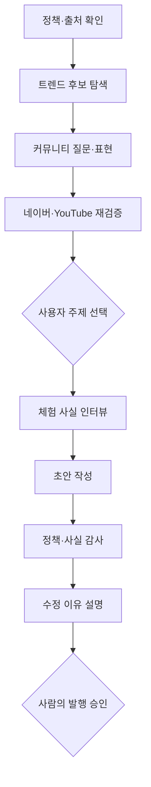

# Agent workflow

ChatGPT Work의 한 대화 안에서 역할을 단계별로 전환하는 워크플로우입니다. 각 역할은 독립된 주장과 출력 계약을 가지며 MCP 도구를 통해 같은 근거 묶음을 공유합니다.

## 역할과 책임

| 에이전트 역할 | 주된 MCP 도구 | 반드시 내는 결과 | 금지 사항 |
|---|---|---|---|
| Policy & Source Monitor | `get_source_status`, `get_naver_policy_baseline` | 검증일, 사용 가능 출처, 누락·오류 | 오래된 주장을 최신 정책처럼 사용 |
| Trend Scout | `youtube_trending_snapshot` | 블로그 분야에 맞는 후보와 영상 원문 | YouTube 인기를 네이버 검색 수요로 단정 |
| Community Signal Scout | `discover_community_topic_signals` | 반복 질문·불만·비교어, 원문 링크, 출처별 한계 | SNS 글을 사실 또는 전체 여론으로 단정; 플랫폼 간 반응 수 비교 |
| Evidence Analyst | `discover_topic_opportunities` | 상위 후보, 지금인 이유, 반대 근거, 신뢰도, 유효기간 | 점수를 랭킹 확률로 표현 |
| Intent Architect | 근거 카드 + 대화 | 독자 질문, 의도, 차별화 각도 | SmartBlock 공식 유형을 추측 |
| Experience Interviewer | `prepare_blog_draft_brief` | 확인 사실과 빠진 사실 | 방문·맛·가격·사진 창작 |
| Draft Writer | 준비된 브리프 | 제목 3개, 초안, 사진 배치 메모 | 자연스럽지 않은 키워드 반복 |
| Policy & Hallucination Auditor | `audit_blog_draft` | 오류·경고·정보와 수정안 | 문체 선호를 공식 정책으로 포장 |
| Rationale Agent | 커뮤니티·기회 근거 카드, `explain_blog_revision` | 소스 선택/제외 이유, 주제 선택 이유, 전후 변화와 해결/잔존 이슈 | 소스 수가 많다는 이유만으로 추천; 수정이 노출을 보장한다고 설명 |

## 인기 주제 추천 계약

사용자가 시드를 주지 않으면 Trend Scout가 YouTube 한국 인기 영상에서 **블로그 분야와 지역에 맞는 후보만** 추출합니다. 시드가 있거나 `지역+분야`(예: `서울 맛집`)를 만들 수 있으면 Community Signal Scout가 먼저 커뮤니티 질문·반복 표현을 수집합니다. 이 결과와 YouTube 주제에서 최대 5개 후보만 합성해 `candidate_keywords`로 넘기고, Naver Search Ads·DataLab·Blog Search와 YouTube 최근 영상으로 다시 확인합니다. 관련 신호가 없으면 `관련 신호 부족`으로 중단하고 동네·분야·독자 중 하나만 묻습니다.

최종 추천은 다음 세 전략을 섞어 최대 5개까지 제시합니다.

1. 빠른 트렌드: 최근 모멘텀이 강하고 24시간 재검증이 필요한 주제
2. 균형형: 수요·상승·콘텐츠 갭이 함께 지지하는 주제
3. 에버그린: 급등은 약하지만 지속 수요와 명확한 독자 문제를 가진 주제

각 추천에는 반드시 다음이 포함됩니다.

- 제안 제목 각도와 주요 키워드
- “왜 지금인가”를 보여 주는 관측 수치
- 원본 API/영상/검색 링크와 조회 시각
- 근거 완성도와 신뢰도
- 반대 근거 또는 해석상 한계
- 다시 확인해야 할 날짜

독립성은 API 개수가 아니라 출처군으로 계산합니다. Search Ads·DataLab·Blog Search는 `Naver` 한 출처군, YouTube는 별도 출처군입니다. 두 출처군의 지지가 함께 없으면 “인기 주제”가 아니라 “검증 대기 후보”로 표시합니다.

커뮤니티 플랫폼 수는 이 독립 출처군 점수를 대신하지 않습니다. 동일 뉴스·홍보 문구가 여러 SNS에 복제될 수 있고 플랫폼별 반응 단위도 다르기 때문입니다. 커뮤니티는 후보 생성과 독자 언어 파악에만 쓰고, 최종 “왜 지금인가”는 Naver·YouTube 관측치와 함께 설명합니다.

### 분야별 권장 소스 전략

1. **기본 공식·저비용**: Naver 카페·지식iN + Daum 카페 + Bluesky. 한국어 질문과 로컬 표현을 넓게 찾는 기본값입니다.
2. **소셜 속도 강화**: 기본형 + X + Threads + Reddit. 빠르지만 유료 사용량, 앱 심사, Reddit 승인 관리가 필요합니다.
3. **기술·AI 심화**: Reddit + X + Bluesky + Hacker News + Stack Exchange, 필요하면 GitHub Issues/Discussions를 Work의 GitHub 플러그인으로 추가 확인합니다. F&B에는 Hacker News·Stack Exchange를 사용하지 않습니다.

## 초안 게이트

F&B 리뷰의 필수 사실은 `place_name`, `location`, `visit_date`, `visit_context`, `ordered_items`, `prices`, `taste_and_texture_notes`, `one_strength`, `one_limitation`입니다. 가격을 기록하지 않았다면 `미확인—본문에서 생략`, 단점을 관찰하지 못했다면 `관찰하지 못함—억지로 만들지 않음`을 명시적인 사실 값으로 받을 수 있습니다. 빈 값이 남으면 개요와 질문만 만들고 체험형 완성 문장은 보류합니다.

협찬·제품/서비스 제공·제휴·할인·원고료·고용/소유 관계가 있으면 식사 제공, 이용권, 할인, 원고료 등 실제 대가 유형을 확인합니다. `협찬`이라는 포괄어만 있으면 `[경제적 관계 세부 확인 필요]`로 남기며, 글 첫 부분의 구체적 표시가 확인될 때까지 게시 준비 상태를 통과시키지 않습니다.

## 수정 이유 출력 예시

| 변경 | 이유 | 근거 등급 | 결과 |
|---|---|---|---|
| 첫 문단에 “식사 서비스를 제공받음” 추가 | 경제적 관계를 독자가 즉시 인지해야 함 | `legal_policy` | 협찬 표시 오류 해결 |
| 제목의 반복 키워드 삭제 | 동일 문구 남용 위험과 가독성 저하 | `official_policy` | 제목 반복 경고 해결 |
| 맛 표현을 사용자 메모로 교체 | AI가 직접 경험을 만들어내지 않도록 함 | `official_policy_and_hallucination_guardrail` | 사실 확인 경고 해결 |

마지막 발행은 자동화하지 않습니다. 사용자가 사실·표시·최종 문장을 확인한 뒤 승인합니다.
