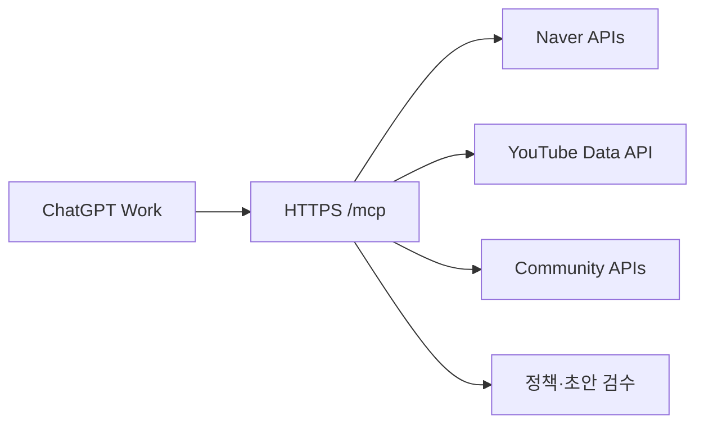

# ChatGPT Work setup

## 구성

이 저장소는 UI가 없는 tool-only MCP 서버입니다. ChatGPT가 대화 안에서 주제 표, 초안, 감사 결과를 직접 렌더링하므로 별도 위젯 없이도 전체 워크플로우를 수행할 수 있습니다.



## 1. 로컬 실행

```bash
python -m venv .venv
source .venv/bin/activate
pip install -r requirements.txt
cp .env.example .env
```

`.env`를 채운 뒤 다음처럼 실행합니다.

```bash
set -a
source .env
set +a
python -m src.mcp_server
```

로컬 엔드포인트는 `http://localhost:8000/mcp`입니다. 비밀키는 채팅 프롬프트나 MCP 입력값으로 전달하지 말고 서버 환경 변수로만 보관하세요.

Naver·YouTube 키가 있어도 사용 API가 활성화되지 않았거나 네이버 키가 구형/신형 중 어느 유형인지에 따라 변수명이 달라집니다. [API credential setup](API_CREDENTIAL_SETUP.md)의 체크리스트를 먼저 확인하세요.

## 2. ChatGPT 연결

ChatGPT 개발자 모드에서 MCP 서버를 추가합니다. 이 저장소는 아직 최종 사용자 인증 계층을 구현하지 않았으므로 **Secure MCP Tunnel을 기본 선택**으로 사용하세요. 공개 HTTPS `https://<host>/mcp`는 MCP 표준 인증, 사용자별 속도/비용 제한, secret manager, 로그 마스킹을 붙인 뒤에만 사용합니다. Workspace 관리자가 개발자 모드와 사용자 역할의 앱 접근을 허용해야 할 수 있습니다.

OpenAI 공식 안내:

- [Build an MCP server](https://developers.openai.com/plugins/build/mcp-server)
- [Define tools](https://developers.openai.com/plugins/plan/tools)
- [Connect and test an MCP app](https://developers.openai.com/apps-sdk/deploy/testing)
- [Developer mode and MCP apps](https://help.openai.com/en/articles/12584461-developer-mode-and-mcp-apps-in-chatgpt)

이 서버의 도구는 모두 읽기 전용입니다. 외부 API를 조회하는 도구는 `openWorldHint=true`, 로컬 검수 도구는 `openWorldHint=false`로 선언되어 있습니다.

읽기 전용이어도 X의 유료 크레딧과 Naver/YouTube/커뮤니티 쿼터는 서버 자산입니다. 인증 없는 공개 endpoint에서 X·Reddit·Threads를 켜지 마세요. Secure MCP Tunnel을 쓸 수 없는 공개 운영 단계에서는 OAuth 보호 계층을 별도 구현하는 작업이 필요합니다.

## 3. 첫 대화 예시

```text
내 블로그는 서울 성수·건대 F&B가 중심이야.
Naver 카페·지식iN, Daum 카페, Bluesky와 사용 가능한 SNS에서 실제 질문과 반복 표현을 먼저 찾아줘.
그중 최대 5개만 Naver와 YouTube로 다시 검증해 빠른 트렌드/균형형/에버그린으로 추천해줘.
각 후보에 원문 링크, 반대 근거, 조회 시각, 재검증 기한을 표로 보여줘. 플랫폼별 반응 수는 서로 비교하지 마.
선택 후에는 내 실제 방문 사실을 먼저 물어보고, 초안·정책 감사·수정 이유까지 진행해줘.
```

## 4. 배포 선택

핵심 기능에 추가 ChatGPT 플러그인은 필요하지 않습니다. SNS 데이터는 이 MCP 서버가 각 공식 API를 읽고, GitHub 플러그인은 저장소 변경 검토와 기술 분야의 공개 Issues/Discussions 보조 조사에 사용합니다. MCP 공개 배포를 ChatGPT 안에서 보조받으려면 다음 중 하나를 선택할 수 있습니다.

- Secure MCP Tunnel: 개인 또는 Workspace 내부 테스트에 권장; 현재 코드와 가장 안전하게 연결
- Cloudflare: 인증 게이트웨이·Workers/Container·Tunnel 중심의 운영을 원할 때
- Vercel: Python 런타임 제약을 확인한 뒤 웹 배포 흐름을 원할 때
- 기존 서버: Docker 또는 프로세스 관리가 가능한 환경이 있을 때

호스팅을 선택하기 전에는 플러그인을 설치할 필요가 없습니다. 운영 배포 시에는 API 키 저장, 요청 인증, 호출량 제한, 원문 응답 로그의 개인정보·비밀값 마스킹을 먼저 정하세요.

## 5. 커뮤니티 API 활성화 순서

1. **즉시 사용**: Bluesky·Hacker News·Stack Exchange는 별도 키 없이 호출할 수 있습니다. Stack Exchange는 키를 넣으면 쿼터가 늘어납니다.
2. **한국어 기본형**: NAVER API HUB 키(또는 유예기간의 기존 Naver Developers 키)로 카페·지식iN을 켜고, Kakao Developers REST API 키로 Daum 카페를 추가합니다.
3. **승인형 SNS**: Reddit은 API 접근 승인을 받은 뒤 `REDDIT_API_APPROVED=true`와 OAuth 3종을 설정합니다. X는 현재 pay-per-use 조건을 확인하고 bearer token을 넣습니다. Threads는 앱에 `threads_keyword_search` 권한과 토큰을 발급한 뒤 `THREADS_KEYWORD_SEARCH_ENABLED=true`로 명시적으로 켭니다.

키와 토큰은 `.env` 또는 배포 환경의 secret manager에만 저장합니다. ChatGPT 대화, MCP 도구 인수, GitHub 커밋, 로그에 넣지 않습니다. 권한이 없는 소스를 사용자가 명시적으로 요청하면 도구는 빈 수치를 만들지 않고 `not_configured` 오류와 공식 신청 문서를 반환합니다.
